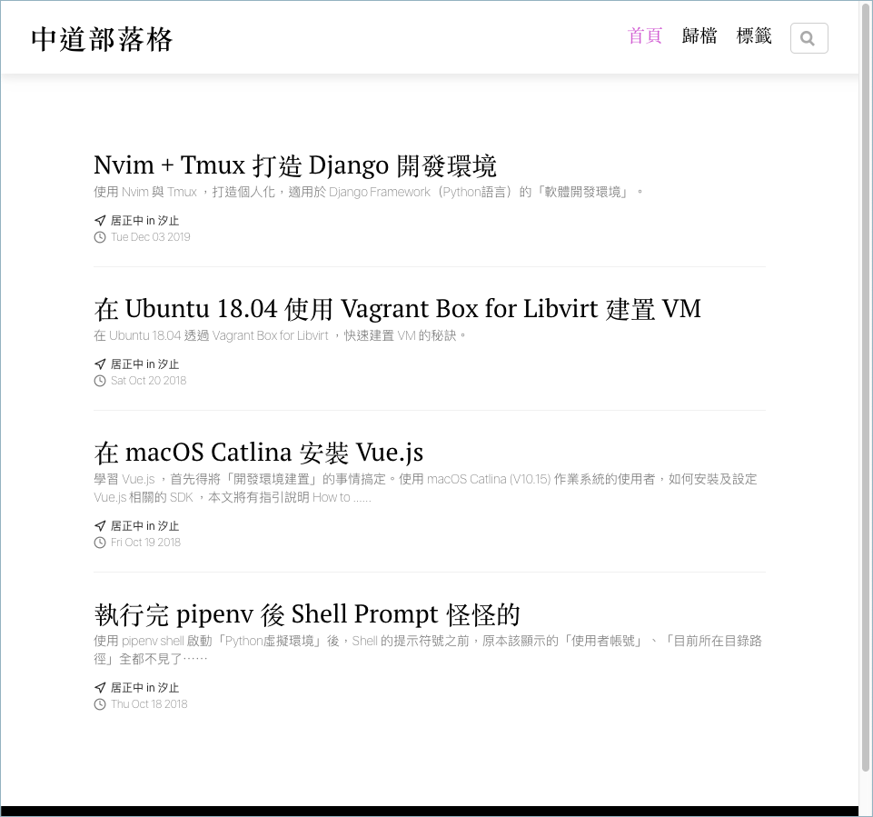
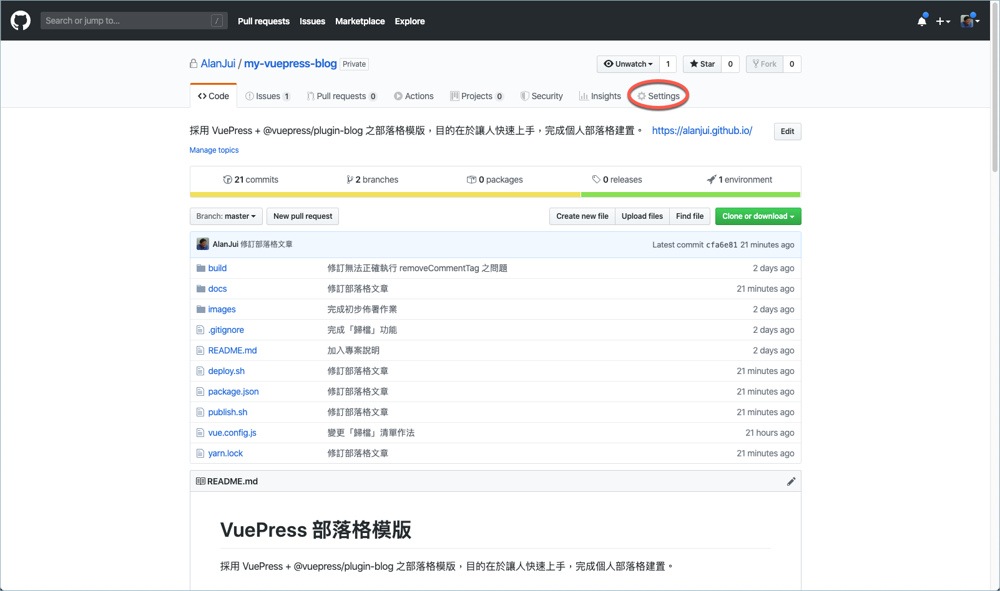
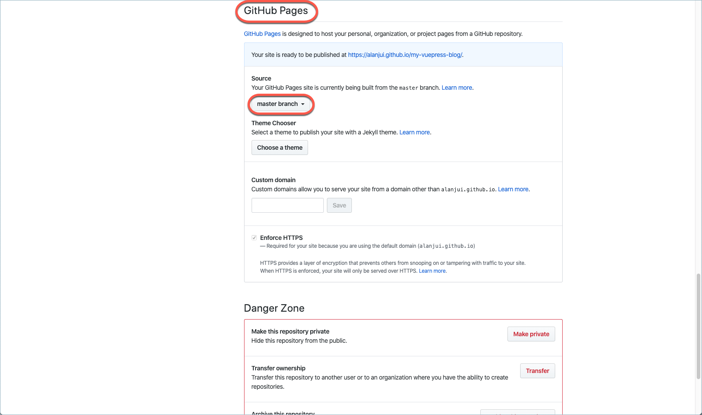
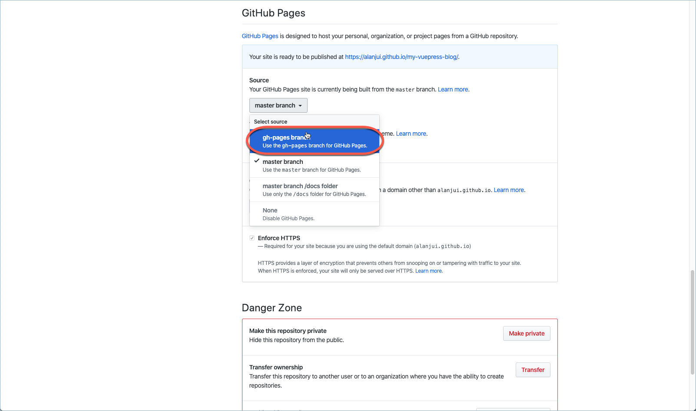
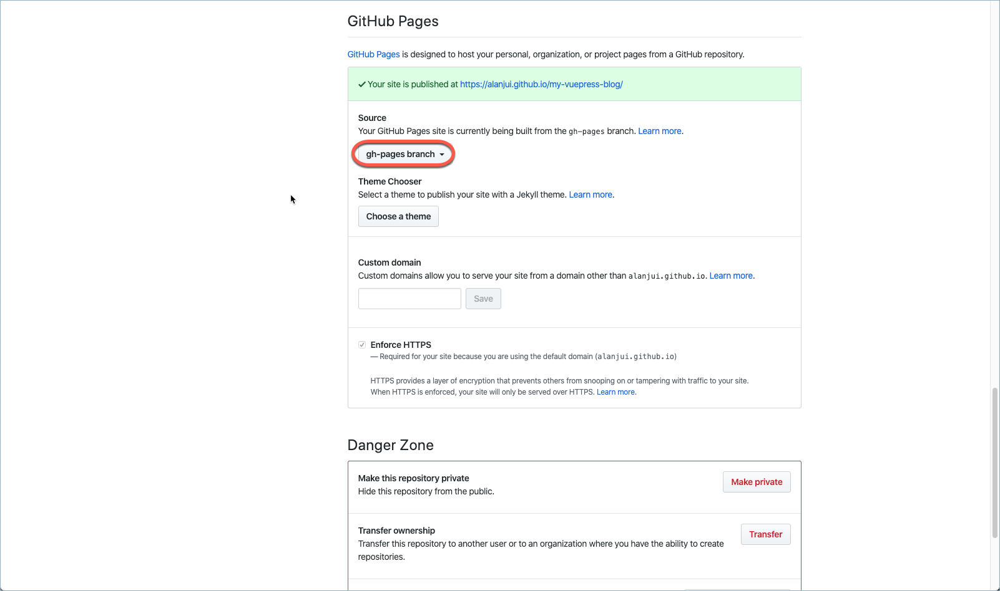
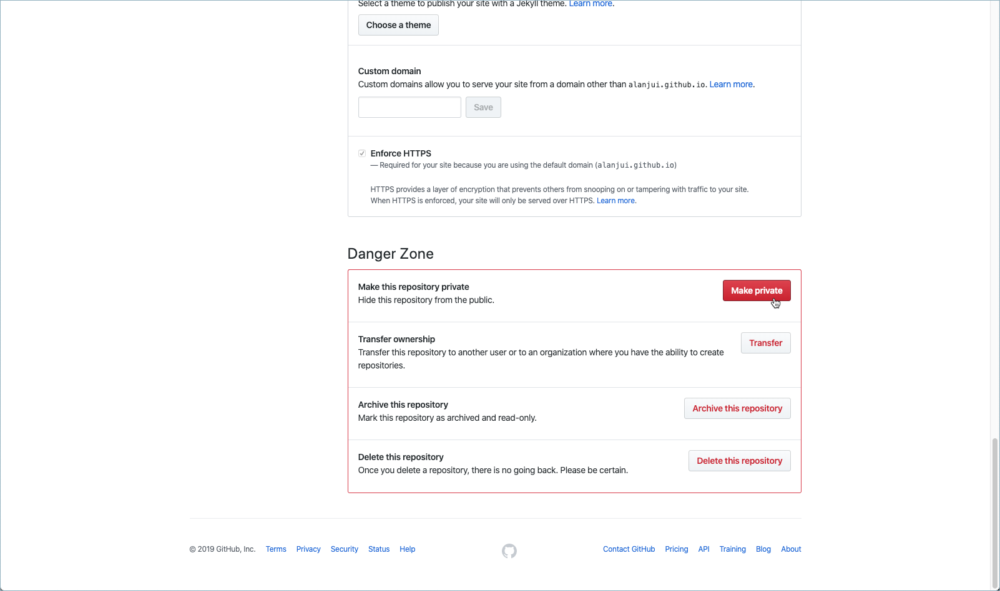
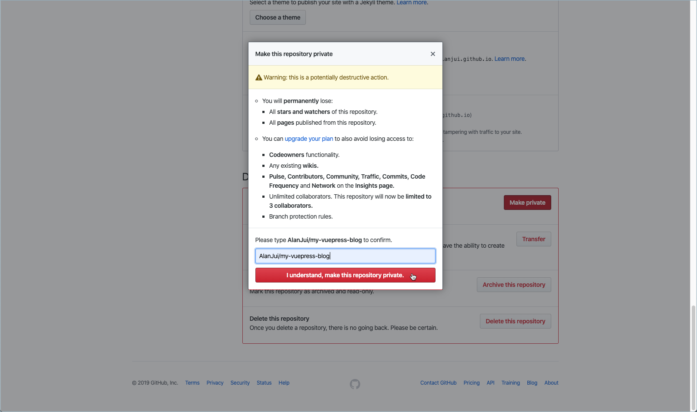
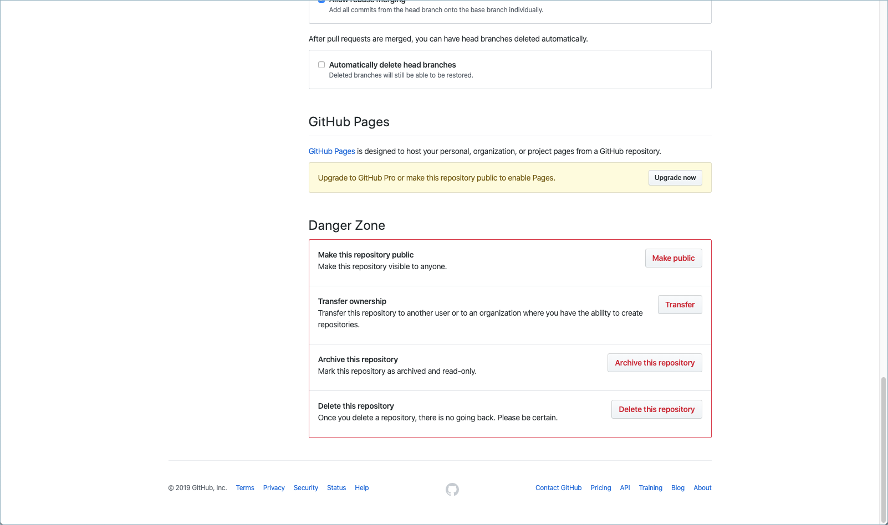

# VuePress 部落格模版

採用 VuePress + @vuepress/plugin-blog 之部落格模版，目的在於讓人快速上手，完成個人部落格建置。

## 環境需求

> 使用 VuePress ，您需要 Node.js ，至少 8.6 以上之版本。

安裝 VuePress

### 使用 npm 安裝

```
npm install -g vuepress
```

### 使用 yarn 安裝

```
yarn global add vuepress
```

> 若是使用 n 作為 Node.js 的版本控管／切換工具，最好不要使用 brew 安裝 yarn ，因為 brew 會自動帶入 node.js 。

## 建置與啟用

先行確認是否符合上述對於 Node.js 之安裝需求。待確認之後，依下列步驟操作，完成個人端電腦之部落格模版啟用設定。

1. 自 GitHub 下載本模版相關檔案。

   ```shell
   $ git clone git@github.com:AlanJui/my-vuepress-blog.git
   $ cd my-vuepress-blog
   ```

2. 安裝 Node.js 相關組件。

   ```shell script
   npm install
   ```

   【註】： 或用 yarn 指令：

   ```shell
   $ yarn install
   ```

3) 啟動 VuePress 編輯模式。

#### 【方法一】：

```shell script
vuepress dev docs
```

#### 【方法二】：

```shell script
npm run dev
```

#### 【方法三】：

```shell
yarn editing
```

4. 啟動 Web 瀏覽器，輸入以下網址，即可看到部落格之內容。

   ```shell script
   http://localhost:8080/
   ```



## 發佈設定作業

1.  執行 Build 組建指令。

#### 【方法一】：

    ```
    $ vuepress build docs
    ```

#### 【方法二】：

    ```
    $ yarn build
    ```

2.  要求 git 略去 dist 目錄。

    (1) 編輯 .gitignore 檔案。

    ```
    $ vim .gitignore
    ```

    (2) 新增設定，要求略去 dist 目錄。

    .gitignore

    ```
    docs/.vuepress/dist/
    ```

3.  將 git subtree，納管入 Local 端的 Git 容器。

    ```
    git add -f docs/.vuepress/dist && git commit -m "Initial dist subtree commit"
    ```

4.  將 Local 端 Git 容器內之 git subtree ，送入 GitHub 端之 Git 容器。

    ```
    git subtree push --prefix docs/.vuepress/dist origin gh-pages
    ```

5.  在 GitHub 端進行 Git Pages 設定。

    (1) 進入 GitHub 容器之管理網頁，點擊「Settings」連結。

    


    (2) 進入 Settings 網頁，捲動畫面至下方，找到「GitHub Pages」處。

    

    (3) 將 Soure 欄內的選項，改成「gh-pages branch」。

    
    

    (4) 將此 GitHub 容器改設成「個人用」。

    
    
    

## 發佈文章作業

透過 publish.sh 指令，將文章發佈至 https://alanjui.github.io/。

```
$ ./publish.sh
```

或

```
$ yarn release
```

## 發佈文章至 GitHub 的專案容器

透過 deploy.sh 指令，將文章發佈至 https://alanjui.github.io/my-vuepress-blog/。

```
$ ./deploy.sh
```

::: tip
記得！此種佈署方式，記得需修改 `.vuepress/config.sys` 設定，得加上 `base: '/my-vuepress-blog/',`
:::

若需手動作業，請依下列步驟執行。

1.  執行組建指令。

    ```
    $ yarn build
    ```

2)  以 git subtree 指令納管於 Local 端容器。

    ```
    git add -f docs/.vuepress/dist && git commit -m "Update commit"
    ```

3)  以 git subtree 指令送入 GitHub 端容器內的 gh-pages 分支。

    ```
    git subtree push --prefix docs/.vuepress/dist origin gh-pages
    ```
