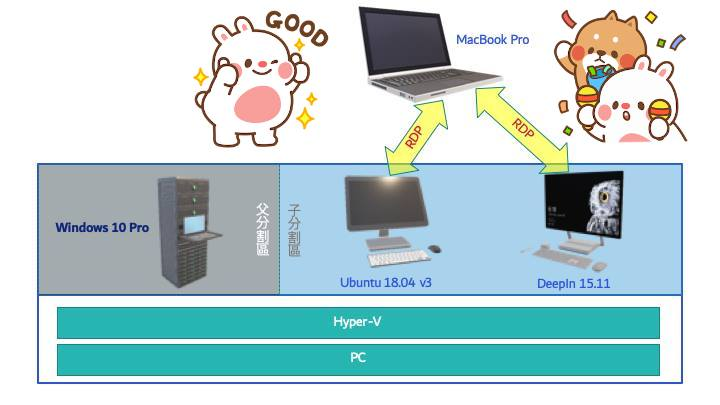

# 在 Ubuntu 或 Debian 作業系統安裝 RDP Server

<!--    -->

最近研習 Django Web App 技術的過程，一如以往，總是鐵板處處，書上寫的東西總是跟不上時代，所以照著書實作一樣會卡關。😝😭

但也一如既往，經過一番的用手 Try 、用腳踹，問題還是能排除掉。只是，解決問題的過程中，曾做了不少的嚐試，到底那一個才是「關鍵」餒？？？ 🤔🤭🥵

不喜歡「問題」的「解決之道」，就這麼：也許、可能、或者是⋯⋯的港覺，所以，想要找個「乾淨」的電腦，再試一次。

好里佳在，家裡有台 PC，備有 16 GB 的記憶體，跑的是 Windows 10 Pro 作業系統，所以這台 PC 具備支援 Hyper-V 虛擬電腦的本事。

高高興興的在這台 PC 上安裝好了：Ubuntu 18.04 v3 與 DeepIn 15.11 兩台虛擬電腦後。想要自 MacBook Pro 這台電腦的 Remote Desktop App 連上那兩台電腦時⋯⋯

欸........

DeepIn 用的 RDP Server 要怎麼安裝啊？！

還好，這裡有人在教
[Debian 9: Install XRDP for remote desktop server](https://www.hiroom2.com/2017/06/19/debian-9-install-xrdp/) 😘😁😁😁

::: tip 【備註】：
雖然 DeepIn 也屬 Debian 系的 Linux 作業系統，同時，Debian 10 預設的桌面系統也是用 Gnome ，但因 DeepIn 用的桌面系統並非 Gnome ，所以，適用於 Ubuntu 18.04 的 RDP 安裝方法，卻不適用於 DeepIn 。
:::

